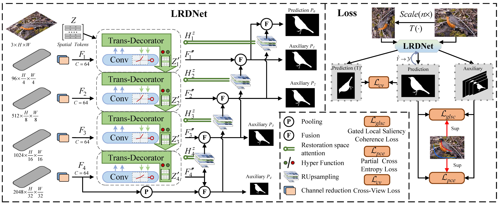
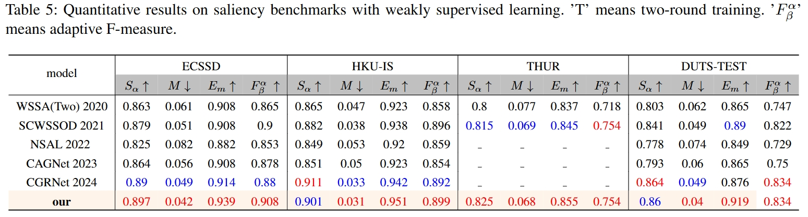

## Long Range Diffusion for Weakly Camouflaged Object Segmentation
This project provides the code and results for 'Long Range Diffusion for Weakly Camouflaged Object Segmentation'
> Authors:
> Rui Wang
> Caijuan Shi, 
> Weixiang Gao,
> Changyu Duan,
> Ao Cai,
> Fei Yu,
> Yunchao Wei

### Network Architecture

### Preparation
The training and testing experiments are conducted using PyTorch with a single GeForce RTX 1080Ti GPU of 12 GB Memory.
#### Configuring your environment:
* Creating a virtual environment : `conda create -n LRDNet python=3.9`
* Installing necessary packages: `pip install -r requirements.txt`
#### Downloading Training and Testing Sets
* Download train datasets S-COD(COD10K-train+CAMO-train): [TrainDatasets](https://drive.google.com/file/d/1D9bf1KeeCJsxxri6d2qAC7z6O1X_fxpt/view?usp=sharing). 
"1" stands for foregrounds, "2" for backgrounds, and "0" for unlabeled regions.
* Download test datasets (CAMO-test+COD10K-test-test+NC4K ):[TestDatasets](https://drive.google.com/file/d/1QEGnP9O7HbN_2tH999O3HRIsErIVYalx/view?usp=sharing)
#### Pretrained Backbone Model
* Download pretrained backbone model:[ResNet50](https://pan.baidu.com/s/1ywGmDdpMfz8_XD0EXEpxrw?pwd=52m1), and put it in `./pth`
### Training 
* Modify the dataset path in `config.py`.
* First Training: run `python train.py`, and it generates catalogue `experiments\` with logs and weights.
* Second Training: run `python train.py --ckpt=last --second_time`
* You can also change the other config option by modify the `config.py`.
### Testing Configuration
* Testing: run `python test.py`, and the result maps are in `experiments\save_images\`.
* We provide LRDNet [testing maps](https://pan.baidu.com/s/1eddSG534wDik5vbvwXAbqA?pwd=4xnq) and [training weights](https://pan.baidu.com/s/1V9Zk6QLbIB1xCv8-sDUFiw?pwd=ponf) presented in the papers.
### Evaluation
* Tools: [PySODMetrics](https://github.com/lartpang/PySODMetrics) A simple and efficient implementation of SOD metrics.
### Results

### Credit
The code is partly based on [CRNet](https://github.com/dddraxxx/Weakly-Supervised-Camouflaged-Object-Detection-with-Scribble-Annotations).

